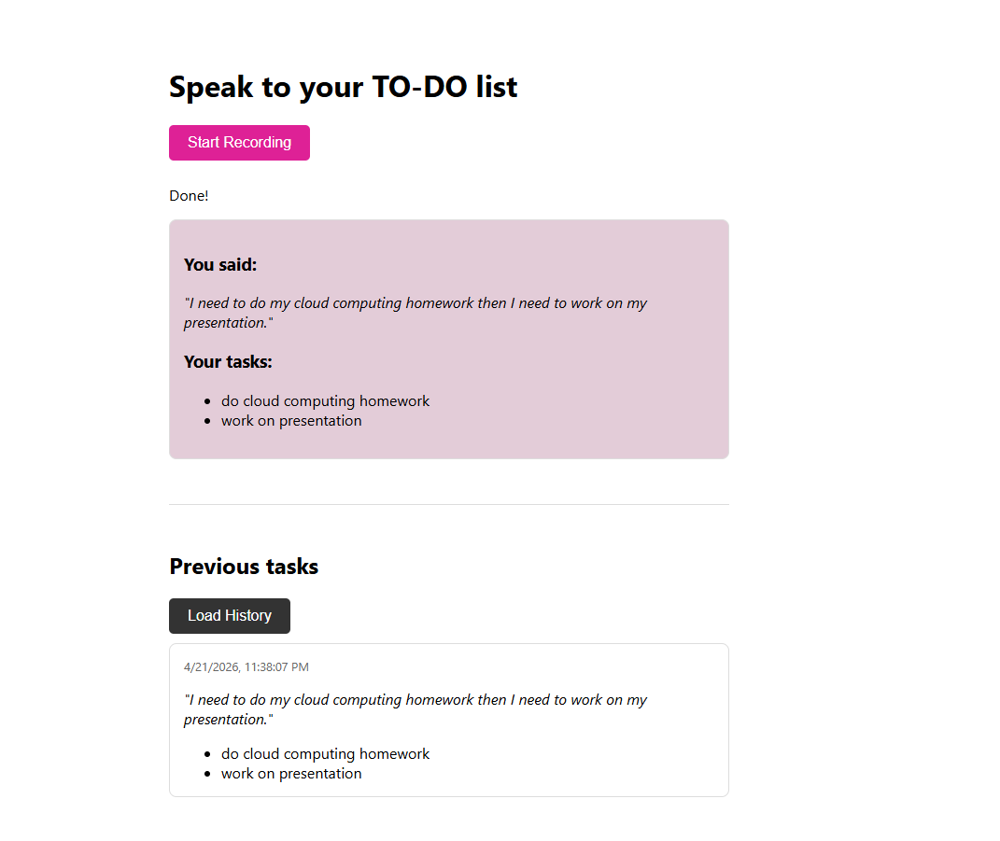

Voice to TO-DO list web application
URL to access the web application:https://8c6e938a.voice-to-notes-bda.pages.dev/

About
This is an AI-powered productivity web application built using Cloudflare's edge network. Users can record voice notes and the application orchestrates multiple AI models to transcribe the audio and automatically extract a structured checklist of action items(creates a TO-DO list). Users can also view a history of their past interactions.

How to use the Tool:
1. click on this link: https://8c6e938a.voice-to-notes-bda.pages.dev/
2. Click on the button to start recording.
3. click on stop recording when done.
4. you will see a transcript of your voice note and a list of tasks extracted from that voice note.
5. to view history of your interaction with the tool. click on load history -> this will generate all past interactions along with the time stamp.

Architecture:
Frontend: Hosted on Cloudflare Pages. using HTML/JS it utilizes the browser's MediaRecorder API to capture the microphone input.
Backend Coordinator:Cloudflare Worker that receives the audio buffer, sequences the AI model calls, and serves the REST APIs(to post the voice note and to get the history).
AI Model 1 (Transcription): Uses Workers AI (@cf/openai/whisper) to transcribe the input audio blob into text.
AI Model 2 (Task Extraction): Uses Workers AI (@cf/meta/llama-3.3-70b-instruct-fp8-fast) to process the transcript and return a structured JSON array..
State Management: Uses Cloudflare D1 (Serverless SQL) to persistently store both the original transcripts and the extracted action items.

To Run Locally
Prerequisites
Node.js installed
Cloudflare account with Workers AI enabled
Wrangler CLI installed globally (npm install -g wrangler)

Backend
1. Navigate to the backend directory: cd backend
2. Authenticate Wrangler: npx wrangler login
3. Create a local D1 database: npx wrangler d1 create voice-notes-db
4. Update wrangler.toml with your generated database_id .
5. Apply the database schema locally: npx wrangler d1 execute voice-notes-db --local --file=./schema.sql
6. Start the local Worker: npx wrangler dev (Runs on localhost)

Frontend
1. Open frontend/app.js and change the uncomment the WORKER_URL variable at the top to http://localhost:8787/api/process.
2. Open frontend/index.html in any web browser.
3. Click "Start Recording" to test.